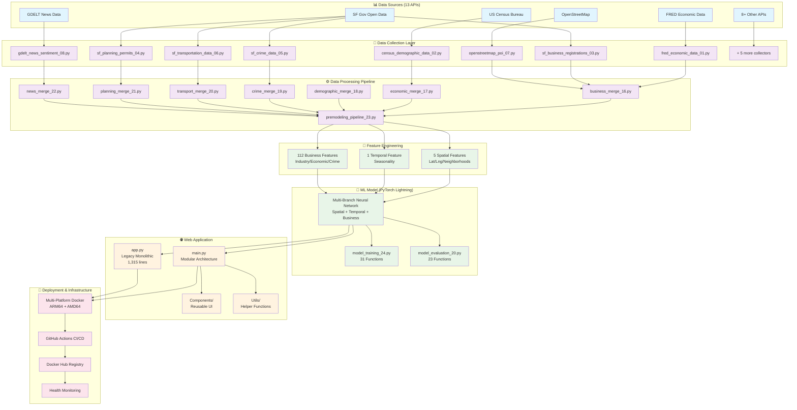

# Architecture Overview

## System Architecture Diagram



## Key Architecture Components

### 1. **Data Collection (13 API Sources)**
- **Economic**: FRED API for macroeconomic indicators
- **Demographic**: US Census Bureau data integration
- **Municipal**: SF Gov Open Data (business registrations, permits, crime)
- **Geographic**: OpenStreetMap points of interest
- **Sentiment**: GDELT news sentiment analysis
- **+ 8 Additional**: Transportation, weather, real estate, etc.

### 2. **Data Processing Pipeline**
- **File Combination**: `file_combination_cleanup_14.py`
- **Business Processing**: `business_data_processing_15.py` 
- **8 Merge Scripts**: Sequential integration (files 16-22)
- **Feature Engineering**: Creates 118 ML-ready features
- **Preprocessing**: `premodeling_pipeline_23.py`

### 3. **Multi-Branch Neural Network**
```
Input Features (118)
├── Spatial Branch (5) → 64 → 32 nodes
├── Temporal Branch (1) → 64 → 32 nodes  
└── Business Branch (112) → 128 → 64 → 32 nodes
    └── Fusion Layer → 128 → 64 → 1 (Binary Output)
```

### 4. **Application Architecture**
- **Legacy**: `app.py` (1,315 lines, monolithic)
- **Optimized**: `main.py` with modular components
- **Deployment**: Multi-platform Docker (ARM64 + AMD64)

### 5. **Production Infrastructure**
- **CI/CD**: GitHub Actions automated workflows
- **Containerization**: Optimized multi-stage Docker builds
- **Registry**: Docker Hub with multi-platform support
- **Monitoring**: Health checks and automated testing

## Data Flow Summary

```
13 API Sources → Raw Data → Processing Pipeline → 118 Features → ML Model → Web Dashboard
     ↓              ↓            ↓               ↓          ↓          ↓
 (Real-time)   (Parquet)   (8 merge scripts) (Engineered) (PyTorch) (Streamlit)
```

## Performance Metrics

- **Data Volume**: 250K+ business records
- **Feature Engineering**: 118 features from 13 sources
- **Model Training**: PyTorch Lightning with automated callbacks
- **Inference Speed**: <100ms per prediction
- **Container Size**: ~2-3GB (optimized from 4.84GB)
- **Platform Support**: Linux AMD64 + ARM64